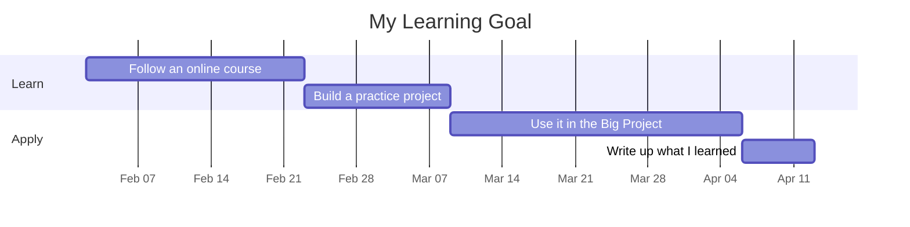
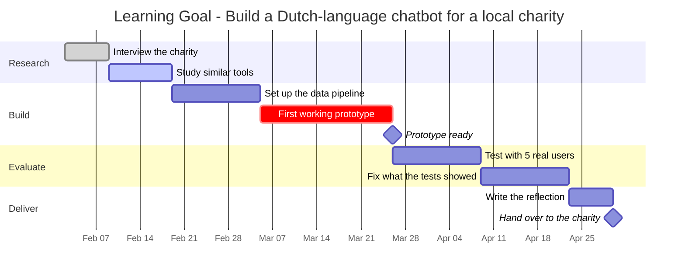

# How to make your Gantt chart

A Gantt chart shows **what happens when**. Time runs left to right, and each bar is a task.
It makes your timeline easy to read - and easy to check.

You do **not** need any special software. GitHub renders [Mermaid](https://mermaid.js.org/syntax/gantt.html)
diagrams directly inside Markdown files.

---

## The quickest version

Write a fenced code block with the word `mermaid` right after the backticks:

````markdown

````

Commit it, open the file on github.com, and the chart appears.

---

## The syntax you need

| Piece | What it does |
|---|---|
| `title ...` | Title above the chart |
| `dateFormat YYYY-MM-DD` | How you write dates |
| `axisFormat %b %d` | How dates appear on the axis (e.g. `Feb 02`) |
| `section Name` | A group of related tasks |
| `Task name :a1, 2027-02-02, 14d` | A task: id, start date, duration |
| `Task name :a2, after a1, 14d` | A task that starts when task `a1` ends |
| `Prototype ready :milestone, m1, 2027-03-15, 0d` | A milestone: a point, not a bar |
| `:done,` / `:active,` / `:crit,` | Mark a task as finished, in progress, or critical |

### A fuller example



---

## Tips

- **Three to eight tasks per goal is plenty.** A chart with 30 bars is not a plan, it is a wall.
- **Put real dates in.** "Sometime in spring" is not a timeline.
- **Leave slack.** Things take longer than you think - build in a buffer week.
- **Mark your milestones** - the moments where something is genuinely finished.
- **Update it during Term 2.** Change tasks to `:done,` as you complete them. A chart that was never
  touched after Week 10 tells your assessor the plan was never actually used.

## Not into Mermaid?

You may also use any other tool - Excel, Google Sheets, Notion, Miro, or the
[Mermaid Live Editor](https://mermaid.live) - and commit a screenshot or PDF here instead.
The chart matters, not the tool.
