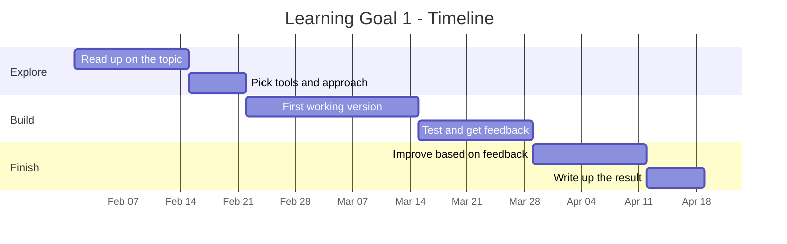

# Learning Goal 1

**Title:**
_A short, concrete name for this goal._

---

## 1. What will you achieve?

_State the goal clearly and concretely. What skill, output or milestone are you aiming for?
Make it something that can be checked: a thing that exists, a number that is met, a skill you can demonstrate._

**I will be finished when:**
_Write the finish line here, in one sentence._

---

## 2. Why do you want to achieve it?

_Explain why this learning goal is of value to you. Not why it is generally useful - why it matters
to you, your interests, your Big Project, or where you want to go after this minor._

---

## 3. How will you achieve it?

_What steps, activities or methods will you use? Break it into concrete actions, not intentions._

1.
2.
3.
4.

---

## 4. Who or what do you need?

**People:**
_Peers, instructors, domain experts - name them if you can, and say what you need from each._

**Tools & software:**

**Data & resources:**

**Possible obstacles, and what I will do about them:**

---

## 5. Timeline

**Start date:**

**Target completion date:**

| Milestone | What is done by then | Deadline |
|---|---|---|
| 1 |  |  |
| 2 |  |  |
| 3 |  |  |
| 4 |  |  |

### Gantt chart

_Replace the example below with your own. See [GANTT_CHART_GUIDE.md](GANTT_CHART_GUIDE.md).
GitHub renders this automatically - you do not need any extra software._

---

## 6. Progress log

_Update this as you go through Term 2. Short entries are fine - but date them._

| Date | What I did | Where I am now |
|---|---|---|
|  |  |  |
